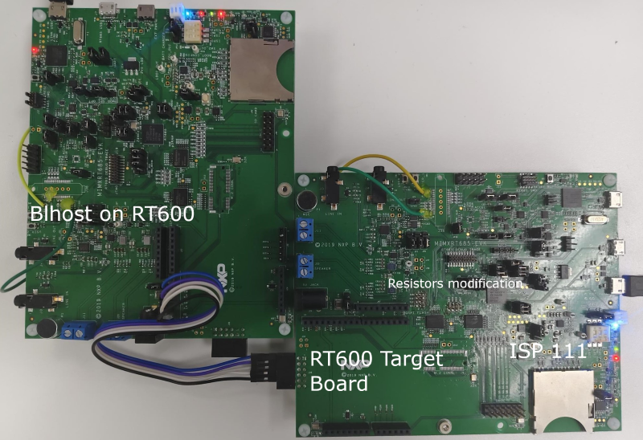
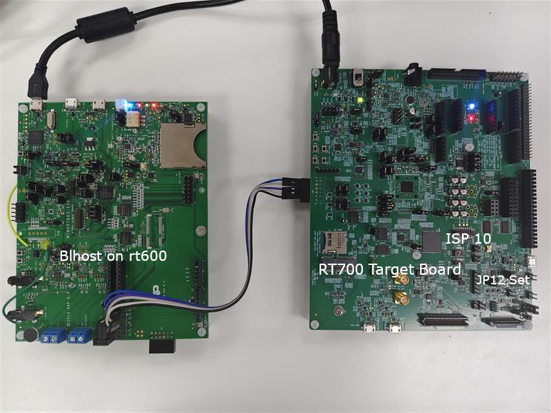

# NXP Application Code Hub
[](https://www.nxp.com)

## BLHOST Porting in i.MXRT685 EVK board for SPI serial downloading

Serial downloading with SPI interface for MCU boot is common when i.MXRT500/RT600/RT700 is acting as co-processor together with application processor.  During boot, application processor downloads microcontroller firmware via SPI/I2C interface.<br /><br />As SPI interface connection between PC and EVK board is not available, the application ports BLHOST 2.6.7 to i.MXRT685 and use EVK-MIMXRT685 for serial downloading boot demo.

#### Boards: EVK-MIMXRT685
#### Categories: Tools
#### Peripherals: SPI
#### Toolchains: IAR

## Table of Contents
1. [Software](#step1)
2. [Hardware](#step2)
3. [Setup](#step3)
4. [Results](#step4)
5. [FAQs](#step5) 
6. [Support](#step6)
7. [Release Notes](#step7)

## 1. Software<a name="step1"></a>
Blhost serial download demo only supports IAR IDE(www.IAR.com). The project is validated using IAR Embedded Workbench for ARM 9.60.3.7274.


## 2. Hardware<a name="step2"></a>
Micro USB Cable
EVK-MIMXRT685 REV E2 Board
Personal Computer

## 3. Setup<a name="step3"></a>
### 3.1 Serial download demo with i.MXRT685 EVK
Resistor switches - Disconnect R385, R386, R387, R388 "A" and connect "B"
Short JP4, VDDIO0 = 1.8V 
The hardware connection is shown in below picture, the cables between "Blhost" board and target board 
|         Blhost EVK         |    Target EVK (i.MXRT685 EVK)   |
| -------------------------  | ------------------------------- |
| PIO1_3 SPI5_CLK  (J28.6)   |   PIO1_11  HS_SPI_CLK (J36.7)   |
| PIO1_4 SPI5_MISO (J28.5)   |   PIO1_12  HS_SPI_MISO (J36.5)  |
| PIO1_5 SPI5_MOSI (J28.4)   |   PIO1_13  HS_SPI_MOSI (J36.3)  |
| PIO1_6 SPI5_SS0  (J28.3)   |   PIO1_14  HS_SPI_SS0  (J36.1)  |
|           GND              |            GND                  |



In IAR project "blhost", you should select build configuration "RT600_firmware". The demo start serial download boot and download RT600 firmware to target board.

### 3.2 Serial download demo with i.MXRT798 EVK
Set JP12, ISP Setting "10"
|         Blhost EVK         |    Target EVK (i.MXRT798 EVK)   |
| -------------------------  | ------------------------------- |
| PIO1_3 SPI5_CLK  (J28.6)   |   PIO3_0  LPSPI14_SCK (J20.7)   |
| PIO1_4 SPI5_MISO (J28.5)   |   PIO3_1  LPSPI14_SOUT (J20.3)  |
| PIO1_5 SPI5_MOSI (J28.4)   |   PIO3_2  LPSPI14_SIN (J20.5)   |
| PIO1_6 SPI5_SS0  (J28.3)   |   PIO3_3  LPSPI14_PCS0 (20.1)   |
|           GND              |            GND                  |




## 4. Results<a name="step4"></a>
With i.MXRT685 EVKs connection, after serial download boot completes, i.MXRT685 EVK starts executing "blinky" example and blue LED will start blinking.
The UART Log print is as following
```
BLHOST.
Ping responded in 1 attempt(s)
Inject command 'get-property'
Response status = 0 (0x0) Success.
Response word 1 = 1258487808 (0x4b030000)
Current Version = K3.0.0
Note: memoryId is not required for write-memory when accessing mapped external memory. Ignore this parameter.
Ping responded in 1 attempt(s)
Inject command 'write-memory'
Preparing to send 13276 (0x33dc) bytes to the target.
Successful generic response to command 'write-memory'
(1/1) 3 generic response to command 'write-memory'
...
(1/1)100generic response to command 'write-memory'
 Completed!
Successful generic response to command 'write-memory'
Response status = 0 (0x0) Success.
Wrote 13276 of 13276 bytes.
Done
```

With i.MXRT798 EVKs connection, after serial download boot completes, i.MXRT700 EVK starts executing "blinky" example and blue LED will start blinking.
The UART Log print is as following
```
BLHOST.
Ping responded in 1 attempt(s)
Inject command 'get-property'
Response status = 0 (0x0) Success.
Response word 1 = 1258488320 (0x4b030200)
Current Version = K3.2.0
Note: memoryId is not required equired Current Version = K3.2.0
Note: memoryId is not required for write-memory when accessing mapped external memory. Ignore this parameter.
Ping responded in 1 attempt(s)
Inject command 'write-memory'
Preparing to send 11575 (0x2d37) bytes to the target.
Successful generic response to command 'write-memory'
(1/1) 4 generic response to command 'write-memory'
...
(1/1)100generic response to command 'write-memory'
 Completed!
Successful generic response to command 'write-memory'
Response status = 0 (0x0) Success.
Wrote 11575 of 11575 bytes.
Ping responded in 1 atten 1 attess.
Wrote 11575 of 11575 bytes.
Ping responded in 1 attempt(s)
Inject command 'execute'
Successful generic response to command 'execute'
Response status = 0 (0x0) Success.
Done
```

*For training content you would usually refer the reader to the training workbook here.*

## 5. FAQs<a name="step5"></a>
1. What is difference between "Blhost on RT600" and "MCULink USBSIO Bridge"?

Blhost supports "MCULink USBSIO" to send Blhost command to MCULink via USB. MCULink acts as a "bridge" to retransmit the command through I2C/SPI.
The "MCULink USBSIO" can be used to debug serial download command. The command/response timing between MCULink and target MCU is controlled by MCULink firmware. The latency/delay between command/response cannot be controlled by parameters.

2. Is there any other IDE supported?

No yet. Blhost is using C++ and there are dependencies in C++ I/O stream library.

## 6. Support<a name="step6"></a>
The blhost application is for use on a host computer to initiate communication and issue commands to an NXP platform running an implementation of the MCU bootloader. Download includes Windows, Linux, and Mac executables. Blhost is downloadable from NXP.com.


#### Project Metadata

<!----- Boards ----->
[]()

<!----- Categories ----->
[](https://mcuxpresso.nxp.com/appcodehub?category=tools)

<!----- Peripherals ----->
[](https://mcuxpresso.nxp.com/appcodehub?peripheral=spi)

<!----- Toolchains ----->
[](https://mcuxpresso.nxp.com/appcodehub?toolchain=iar)

Questions regarding the content/correctness of this example can be entered as Issues within this GitHub repository.

>**Warning**: For more general technical questions regarding NXP Microcontrollers and the difference in expected functionality, enter your questions on the [NXP Community Forum](https://community.nxp.com/)

[](https://www.youtube.com/NXP_Semiconductors)
[](https://www.linkedin.com/company/nxp-semiconductors)
[](https://www.facebook.com/nxpsemi/)
[](https://x.com/NXP)

## 7. Release Notes<a name="step7"></a>
| Version | Description / Update                           | Date                        |
|:-------:|------------------------------------------------|----------------------------:|
| 1.0     | Initial release on Application Code Hub        | June 23<sup>rd</sup> 2025 |
